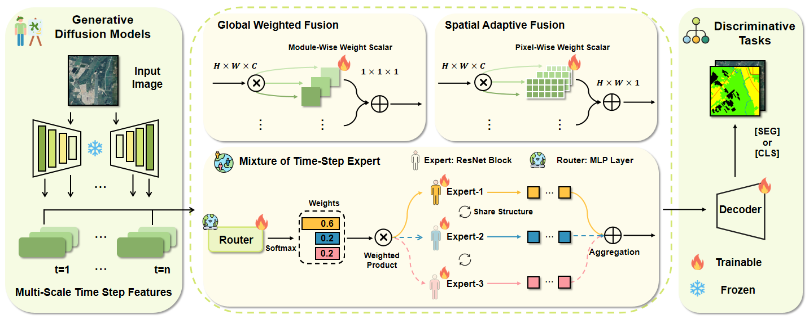

## SatDiFuser: Can Generative Geospatial Diffusion Models Excel as Discriminative Geospatial Foundation Models?

**ICCV 2025** [[ArXiv]](https://arxiv.org/pdf/2503.07890)

By [Yuru Jia](https://yurujaja.github.io), [Valerio Marsocci](https://sites.google.com/uniroma1.it/valeriomarsocci), [Ziyang Gong](https://scholar.google.com/citations?user=cWip8QgAAAAJ&hl=en&oi=ao), [Xue Yang](https://yangxue.site), [Maarten Vergauwen](https://iiw.kuleuven.be/onderzoek/geomatics/people/00002399), [Andrea Nascetti](https://www.kth.se/profile/nascetti)

SatDiFuser explores self-supervised learning (SSL) with diffusion models as geospatial foundation models (GFMs) for remote sensing. While most GFMs use contrastive learning or masked image modeling, SatDiFuser shows that diffusion-based generative models can also learn powerful discriminative representations. By analyzing multi-stage, noise-dependent features and introducing three fusion strategies, SatDiFuser achieves state-of-the-art results on remote sensing benchmarks, highlighting the untapped potential of diffusion models for SSL in RS.



Please follow the instructions below to set up the experiments.
## ⚙️ Setup

- **Environment**: python 3.11.5, CUDA 12.4.0
- **Clone**:
```bash
  git clone https://github.com/yurujaja/SatDiFuser.git
  cd SatDiFuser
```
- **Install dependencies**:
```bash
pip install -r requirements.txt
pip install --no-deps geobench
```
- **Download DiffusionSat checkpoints**: Our approach builds on DiffusionSat ([paper](https://arxiv.org/abs/2312.03606)).
  - Download 512×512 and 256×256 checkpoints from [512×512](https://zenodo.org/records/13751498) and [256×256](https://zenodo.org/records/13756199)
  - Place them under `diffusionsat/pretrained/resolution512` and `diffusionsat/pretrained/resolution256`
  - Point `pretrained_model_name_or_path` in `configs/_base_/diffusionsat.yaml` to your root checkpoints directory

## 📊 Downstream Tasks

- **GEO-Bench**: We evaluate on GEO-Bench ([paper](https://arxiv.org/abs/2306.03831)). 
- **Download and setup**:
  - See GEO-Bench [downloading guide](https://github.com/ServiceNow/geo-bench?tab=readme-ov-file#downloading-the-data)
  - See [dataset implementation](https://github.com/VMarsocci/pangaea-bench/tree/main/pangaea/datasets/geobench) in PANGAEA
  - Export data root: `export GEO_BENCH_DIR=/path/to/geobench`

## 📎 Configuration 

Configs are composed from multiple YAML files. An experiment file (e.g., `configs/eurosat_exp.yaml`) lists a `base:` array that includes:

- `configs/_base_/diffusionsat.yaml` — DiffusionSat backbone settings
- `configs/_base_/satdifuser.yaml` — SatDiFuser extraction/fusion settings
- Task-specific decoder base (e.g., `configs/_base_/upernet.yaml` for segmentation)
- Dataset/task config under `configs/tasks/` (e.g., `configs/tasks/meurosat.yaml`)

### Tips

- `configs/_base_/diffusionsat.yaml`
  - **pretrained_model_name_or_path**: root folder for checkpoints
  - **use_metadata / num_metadata / low_cpu_mem_usage / revision**: backbone loading flags

- `configs/_base_/satdifuser.yaml`
  - **Fusion variant**: Set `fuser` to `gw`, `lw`, or `moe` in `configs/_base_/satdifuser.yaml`.
  - **fuser**: fusion variant — `gw` (Global-Weighted), `lw` (Localized-Weighted), `moe` (Mixture-of-Experts)
  - **layer_idxs**: which UNet blocks/layers to extract from
  - **projection_dim**: bottleneck output channel dimension per feature stream
  - **save_timesteps**: diffusion timesteps to extract
  - **num_timesteps / diffusion_mode**: diffusion settings
  - MoE-only: **num_experts**, **top_k**

- `configs/_base_/upernet.yaml` (segmentation only)
  - **rescales**: per-scale resize factors into the feature pyramid
  - **pool_scales**: PPM pooling scales (e.g., 1, 2, 3, 6)
  - **channels**: decoder channels for UPerNet head (must be a positive int)

### Dataset/task configs (`configs/tasks/*.yaml`)

- Classification example `configs/tasks/meurosat.yaml`:
  - **task**: `classification`
  - **num_classes**, **original_img_size**, **img_size**, **num_channels**, **class_list**
  - **prompt**, **resize_outputs**

- Segmentation example `configs/tasks/mnz_cattle.yaml`:
  - **task**: `segmentation`
  - **num_classes**, **class_names**, **original_img_size**, **img_size**, **num_channels**
  - **prompt**, **resize_outputs**

### Experiment files (`configs/*_exp.yaml`)


## Running

Update your experiment file to include the right dataset task file in its `base:` list.

**Example**: Eurosat classification, with experiment file: `configs/eurosat_exp.yaml` with `configs/tasks/meurosat.yaml` in `base:`

```bash
python run.py --config configs/eurosat_exp.yaml
```

### Example: New Zealand cattle segmentation

Experiment file: `configs/nzcattle_exp.yaml` with `configs/tasks/mnz_cattle.yaml` in `base:`

```bash
python run.py --config configs/nzcattle_exp.yaml
```

## ✏️ Acknowledgements

We thank prior work and codebases: [Diffusion Hyperfeatures](https://github.com/diffusion-hyperfeatures/diffusion_hyperfeatures), [SLiMe](https://github.com/aliasgharkhani/SLiMe), [DiffSeg](https://github.com/google/diffseg/tree/main), [DiffCut](https://diffcut-segmentation.github.io), [PANGAEA](https://github.com/VMarsocci/pangaea-bench), [GEO-Bench](https://github.com/ServiceNow/geo-bench). We also acknowledge the National Academic Infrastructure for Supercomputing in Sweden (NAISS, Grant No. 2022-06725) for supporting the computations and data handling.

## 🎓 Citation

```text
@inproceedings{jia2025satdifuser,
  title={Can Generative Geospatial Diffusion Models Excel as Discriminative Geospatial Foundation Models?},
  author={Jia, Yuru and Marsocci, Valerio and Gong, Ziyang and Yang, Xue and Vergauwen, Maarten and Nascetti, Andrea},
  booktitle={International Conference on Computer Vision (ICCV)},
  year={2025}
}
```